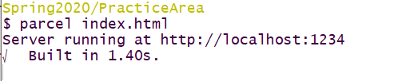
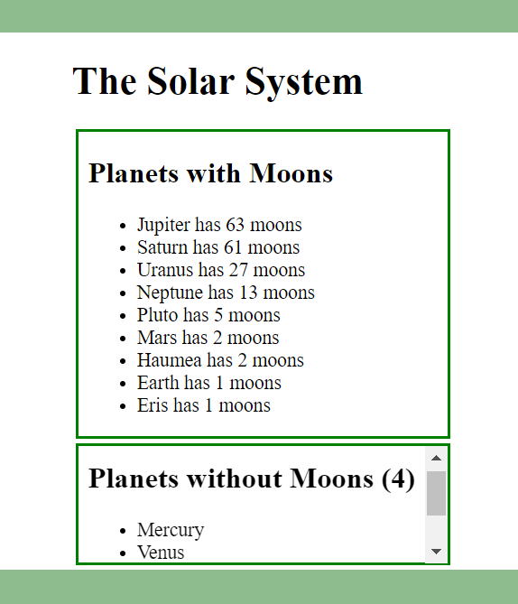

# Question 1 Planets (25 pts)

You are starting work on a solar system React based App. The layout and styling has been done for you.
You are provided with the following files:

* An `index.html`. **This cannot be modified.**

* A `index.js` file containing the main React App. **This cannot be modified.**

* A `question1.css` CSS file that contains all the CSS for the site. **This cannot be modified.** 

* A `planets.json` file which contains information about major and minor planets in the solar system. This **cannot** be modified or imported into your components.

You will deliver to me **two** files. One for each React component you are asked to create.

These files must implement the functionality described below.

## (a) Create Files and Empty Functional Components (5 pts)

Get your *Parcel.js* build working by:

* Creating the Javascript files mentioned above
* Creating the appropriately name React *functional* components in those files.
* Exporting those components in the appropriate way so that the `index.js` file can import them.

At this point you should have a clean build as shown in the screen shot below.

## (b) `PlanetsMoons` Functionality (15 pts)

You will now give the *PlanetsMoons* component the following functionality:

* It returns a `<section>` element containing the following
* A heading of some type with content: "Planets with Moons"
* An unordered list of planets with count of their moons. These planets must have at least one moon to be in the list.
* Sorted in decreasing order from the planet with the most moons down to planets with only one moon.
* The information should look like the top half of the screen shot below. No extra styling is allowed.

## (c) `PlanetsNoMoons` Functionality (5 pts)

You will now give the *PlanetsNoMoons* component the following functionality:

* It returns a `<section>` element with the *CSS* class `NoMoons` containing the following:
* A heading with a summary of the **number** of planets without moons, like in the screenshot
* An unordered list of planets without moons 
* The information should look like the bottom half of thescreen shot above. No extra styling is allowed.

