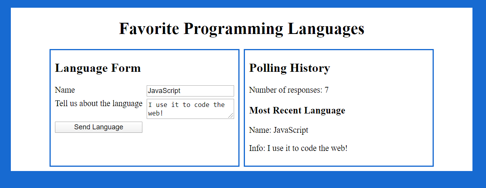
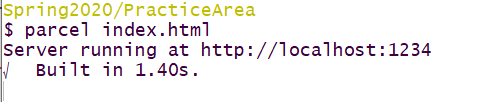

# Question 2 Programming Languages (20 pts)

You are starting work on a React based App for an online poll of programming *Languages*. The layout and styling has been done for you. As shown below:

You are provided with the following files:

* An `index.html` file. **This cannot be modified.**

* An `index.js` file containing the main React App. This shows the *Language* poll history on the right side of the App page. You are **only allowed to modify** this file in *two* locations as indicated in coments in the file.

* A `question2.css` CSS file that contains all the CSS for the site. **This cannot be modified.** 

Your will create/modify **two** files:

* A new file for the React component you are asked to create
* An updated `index.js` React App, where only limited changes are allowed as specified in the comments in the file.

These files must implement the functionality described below.

## (a) Create Files and Empty *Language* Component (5 pts)

Get your *Parcel.js* build working by:

* Creating the new Javascript file to hold the **Language** component
* Creating the appropriately name React *class* **Language** component in that file.
* Exporting the component in the appropriate way so that the `index.js` file can import it.

At this point you should have a clean build as shown in the screen shot below.

## (b) Component Mockup (5 pts)

You will now give the *Language* component, shown on the left side of the top figure, the following functionality:

* It returns a `
` element containing the following
* An `<h2>` element containing the form title
* A `
` element that will hold labels, text area, inputs, and button. This will receive grid styling from the style sheet (do not change or add styling).
* An input element for the *name* of the Language
* A text area for language *info*
* A *Send Language* button

***Note***: Your component does not need to update the input, text area, or respond to button click, at this point, to receive these points.

## (c) State and Event Handling (5 pts)

You will now give the *Language* component, shown on the left side of the top figure, the following additional functionality:

* Changes to the input and the text area update the component state.
* On the click of *Send Language* button you will log the components state to the developers console.

## (d) Update Parent Components *languages* Array (5 pts)

* On the click of *Send Language* button in addition to what you did in part (c) you need to add this *language*  to the list of **languages** kept by the ***App*** in the `index.js` file.

* You are allowed to modify the `index.js` in two places to help you do this.

