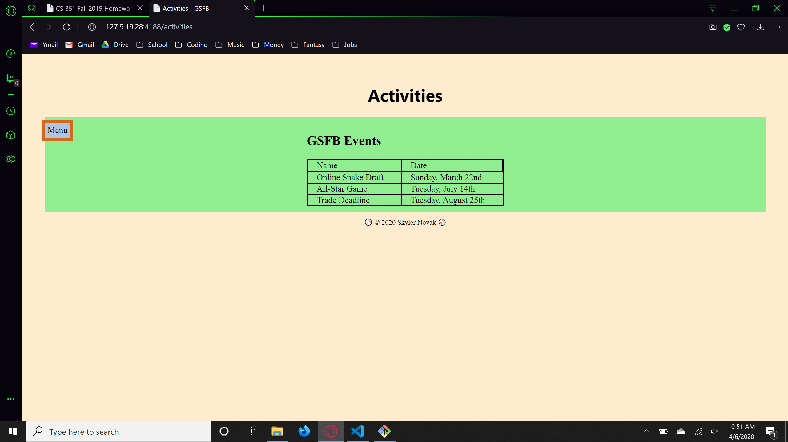

# Homework 9 Solution
**Skyler Novak**

**NetID: ix9753**

# Question 1

## (a)

```Javascript
let salt = bcrypt.genSaltSync(10); // create a new salt
users.forEach(function(user) {
    let passHash = bcrypt.hashSync(user.password, salt);    // hash password with the salt
    user.password = passHash;   // update user password with hash
    hashedUsers.push(user); // add users with hashed passwords to DB
});
```

example of hashed user

```JSON
{
    "firstName": "Marx",
    "lastName": "Wolf",
    "email": "dewit1966@gmail.com",
    "password": "$2a$10$TcB0KAw2faioVzWjK.HMn.H051Mudk027L98V56YfXwKlqdfD6zbu",
    "role": "member"
}
```

## (b)


# Question 2

## (a)


```Javascript
app.get('/activities', function(req, res){
    res.json(events);
});
```

## (b)


```JavaSCRIPT
const rp = require("request-promise-native");
const events = require('./eventData.json');

var options = {
    uri: 'http://127.9.19.28:4188/activities',
    headers: {
        'User-Agent': 'Request-Promise'
    },
    json: true // Automatically parses the JSON string in the response
};

rp(options)
    .then(function (event) {
        console.log(event);
    })
    .catch(function (err) {
        // call failed...
    });
```

## (c)

```Javascript
const members = require('./clubUsers.json');
app.get('/members', function(req, res) {
    res.json(members);
});
```

## (d)


# Question 3

## (a)

```Javascript
app.post('/addActivity', express.json(), function(req, res) {
    console.log(`path /addActivity recieved: ${JSON.stringify(req.body)}`);
    events.push(req.body);
    res.json(events);
});
```

## (b)

```Javascript
const rp = require("request-promise-native");
const events = require('./eventData.json');
var request = require('request');

var options = {
    uri: 'http://127.9.19.28:4188/addActivities',
    headers: {
        'User-Agent': 'Request-Promise'
    },
    method: "POST",
    json: true, // Automatically parses the JSON string in the response
    body: events
};

console.log("POST JSON test");
request(options, function(error, res, body) {
    console.log("error: " + error);
    console.log("body: " + body);
});
```

# Question 4

## (a)

Project initilized

## (b)

React debugging extension added to my Opera browser

## (c)



# Question 5

## (a)

Event data and css style sheet populated in directory

## (b)

