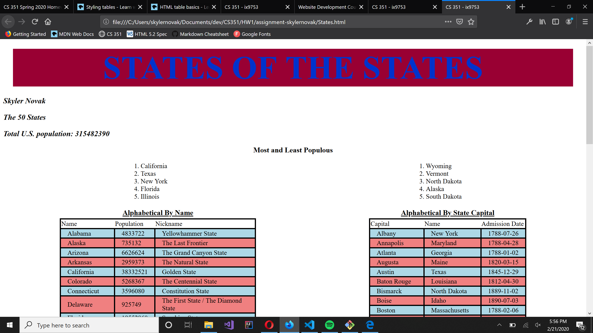

# Homework #3 Solution
**Skyler Novak**

**NetID: ix9753**

# Question 1

## (a)

I included images on the following pages:
+ index.html
+ about.html

Here is a screenshot of the image on the homepage


## (b)

I added the following emoji's:
+ baseballs flanking the footer `&#x26be`
+ a trophy next to the league champion history `&#x1f3c6`

as seen here:


# Question 2

## (a)


## (b)

http://csweb01.csueastbay.edu/~ix9753/clubProject/index.html

# Question 3

## (a)

```javascript
document.title = "CS 351 - ix9753";
document.getElementById("Author").innerHTML = "Skyler Novak";
```

## (b)

```javascript
document.getElementById("Number").innerHTML = "The " + states.length + " States";
let initialValue = 0;
var total2 = states.reduce(function (accu, curr) {
    return accu + curr.population
}, initialValue);
document.getElementById("TotalPop").innerHTML = "Total U.S. population: " + total2;
```

## (c)
```javascript
// sort least populous
        function comparePop(a, b) {
            return a.population - b.population;
        }
        states.sort(comparePop);
        // populate least list
        const leastPopelement = document.querySelector('.least');

        let node = document.createElement("li");
        let stateNode = document.createTextNode(states[0].state);
        node.appendChild(stateNode);
        leastPopelement.appendChild(node);

        node = document.createElement("li");
        stateNode = document.createTextNode(states[1].state);
        node.appendChild(stateNode);
        leastPopelement.appendChild(node);

        node = document.createElement("li");
        stateNode = document.createTextNode(states[2].state);
        node.appendChild(stateNode);
        leastPopelement.appendChild(node);

        node = document.createElement("li");
        stateNode = document.createTextNode(states[3].state);
        node.appendChild(stateNode);
        leastPopelement.appendChild(node);

        node = document.createElement("li");
        stateNode = document.createTextNode(states[4].state);
        node.appendChild(stateNode);
        leastPopelement.appendChild(node);

        // reverse list, populate most populous list
        states.reverse();
        const mostPopelement = document.querySelector('.most');

        node = document.createElement("li");
        stateNode = document.createTextNode(states[0].state);
        node.appendChild(stateNode);
        mostPopelement.appendChild(node);

        node = document.createElement("li");
        stateNode = document.createTextNode(states[1].state);
        node.appendChild(stateNode);
        mostPopelement.appendChild(node);

        node = document.createElement("li");
        stateNode = document.createTextNode(states[2].state);
        node.appendChild(stateNode);
        mostPopelement.appendChild(node);

        node = document.createElement("li");
        stateNode = document.createTextNode(states[3].state);
        node.appendChild(stateNode);
        mostPopelement.appendChild(node);

        node = document.createElement("li");
        stateNode = document.createTextNode(states[4].state);
        node.appendChild(stateNode);
        mostPopelement.appendChild(node);
```

# Question 4

## (a)

```javascript
function compareNames(a, b) {
          if (a.state < b.state)
                        return -1;
                    else if (a.state > b.state)
                        return 1;
                    else return 0;
        };

        function stateTableName() {
            let tbody = document.querySelector("#AlphaName tbody");
            states.sort(compareNames);
            states.forEach(function(state) {
                let tr = document.createElement("tr");
                tr.innerHTML = `<td>${state.state}</td><td>${state.population}</td><td>${state.nickname}</td>`;
                tbody.appendChild(tr);
            })
        }

        stateTableName();
```

## (b)

```javascript
function compareStateCap(a, b) {
            if (a.capital_city < b.capital_city)
                        return -1;
            else if (a.capital_city > b.capital_city)
                        return 1;
            else return 0;
        };

        function stateTableCapital() {
            let tbody = document.querySelector("#AlphaCapital tbody");
            states.sort(compareStateCap);
            states.forEach(function(state) {
                let tr = document.createElement("tr");
                tr.innerHTML = `<td>${state.capital_city}</td><td>${state.state}</td><td>${state.admission_date}</td>`;
                tbody.appendChild(tr);
            })
        }

        stateTableCapital();
```

# Question 5


