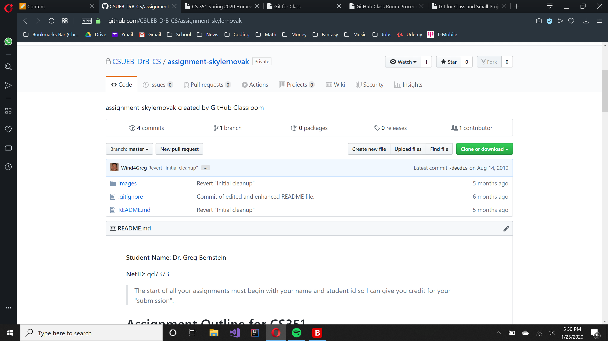
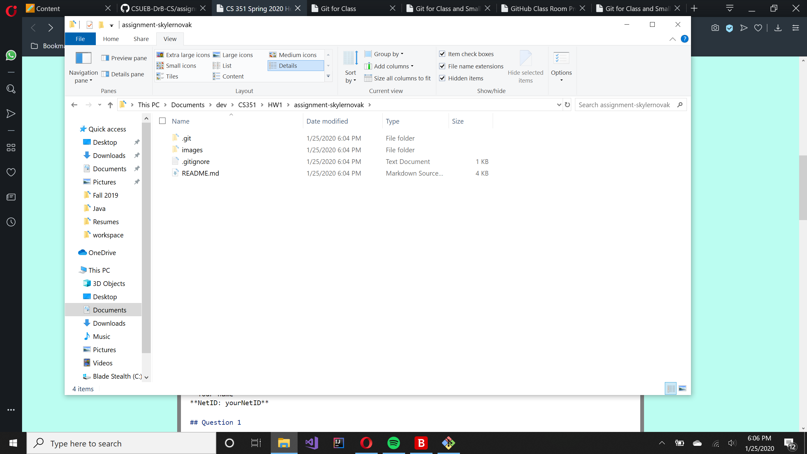
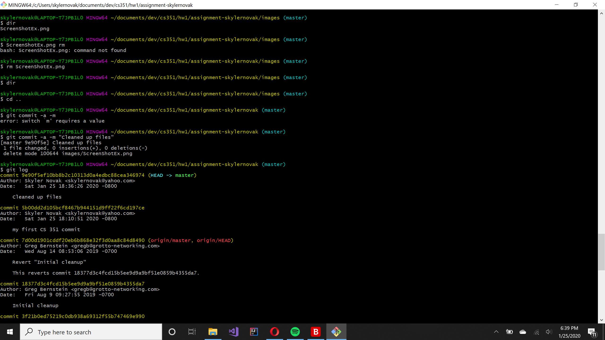
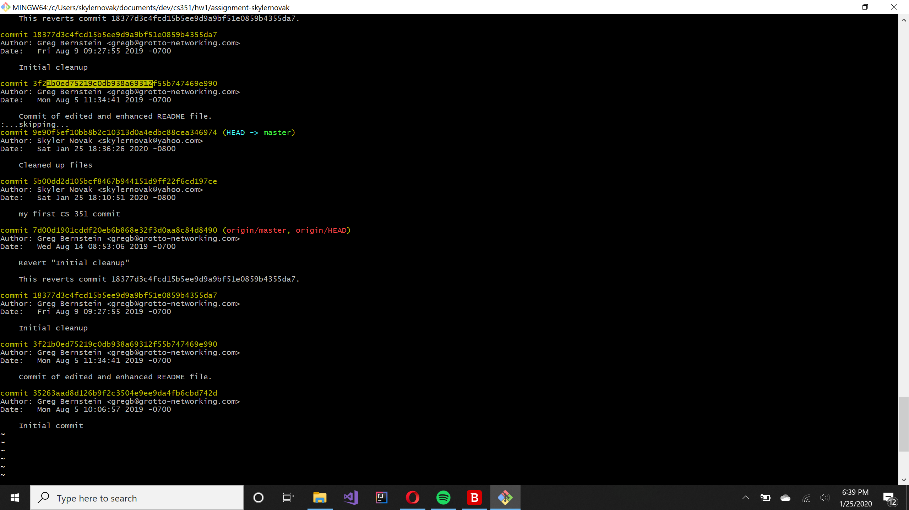
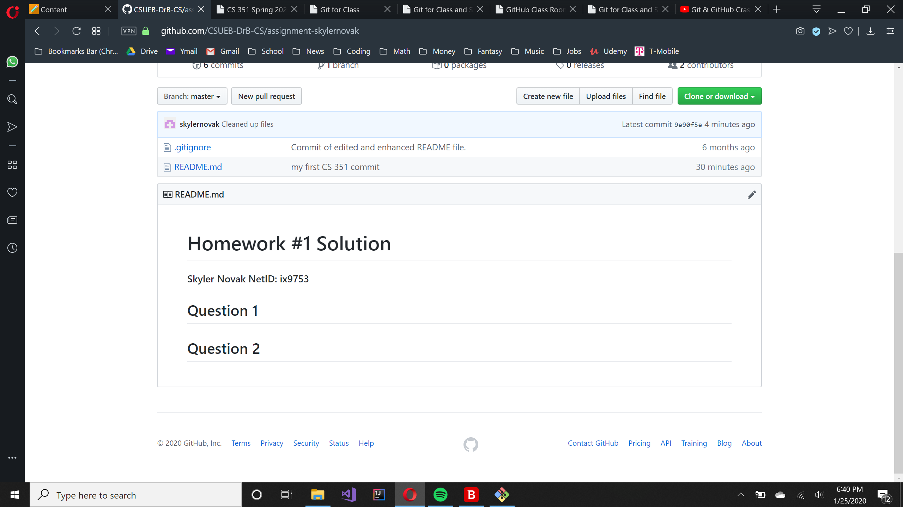

# Homework #1 Solution
**Skyler Novak**
**NetID: ix9753**

## Question 1

### (a)



### (b)



## Question 2

### (b)



### (c)


## Question 3

## Question 4

### (a)

1. C++
2. Java
3. Python

### (b)

+ Windows 10
+ Linux Ubuntu
+ Macintosh

### (c)

+ Code Blocks
+ Visual Studios
+ Eclipse
+ Intellij IDEA

## Question 5

### (a)

Sample of `Java` code:
```Java
		File file = new File("02PlInv.txt");
		if(!file.exists()) {
			System.out.println("Input file does not exist!");
			return;
		} 
		Scanner inputFile = new Scanner(file);
```

### (b)

For my programming tool, I have selected VS Code. It is a fast, lightweight code editor with heavyweight funtionality. It has the following features:
+ IntelliSense - intelligent code completetion that learns from you and your code
+ Built in debugging - no more print line debugging!
+ Built in Git - compare diffs, stage files, commit, push, pull all from right in VS Code
+ Extensible - many extensions! If it doesn't come with the language you want, get the extension!

You can get VS Code [here].

[here]: https://code.visualstudio.com
