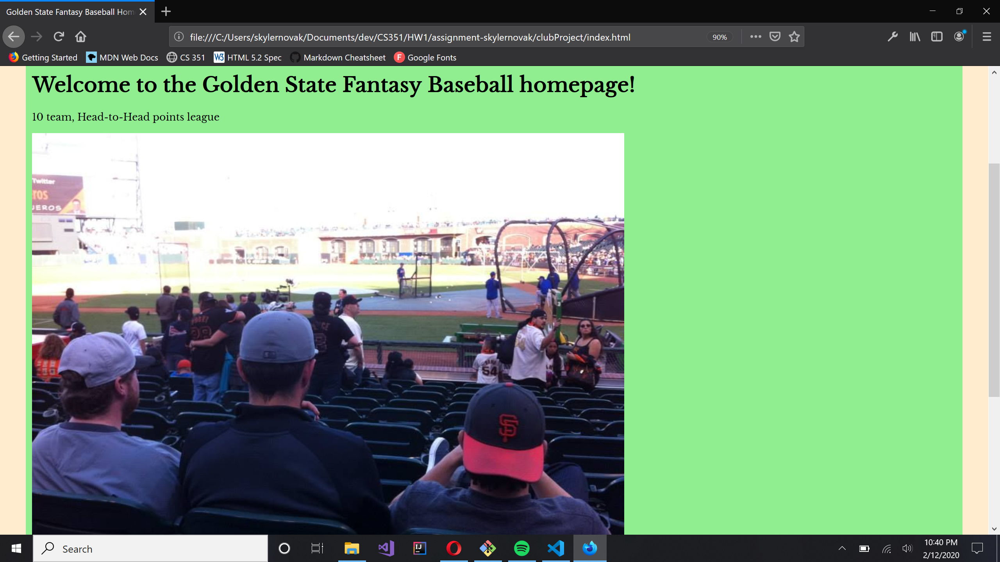
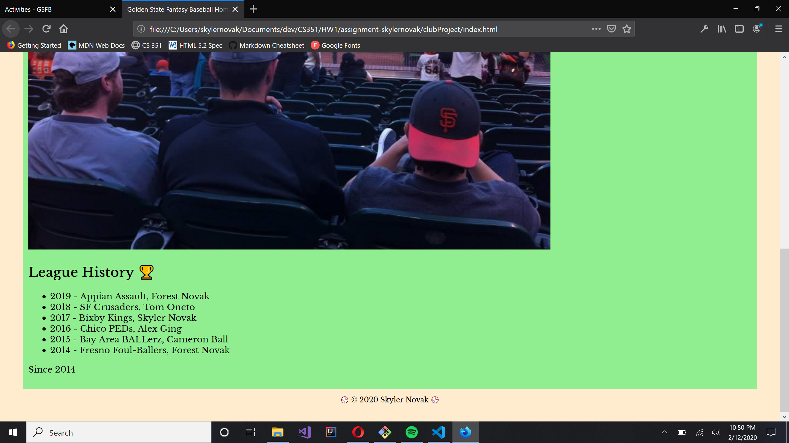
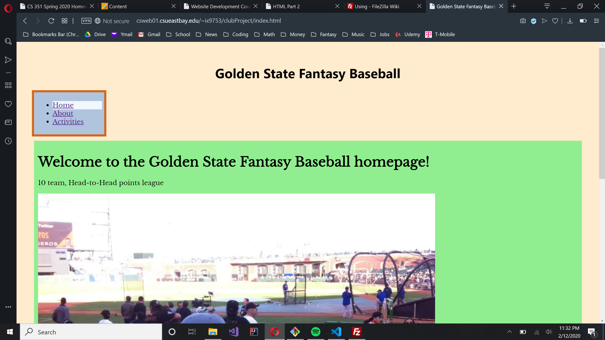
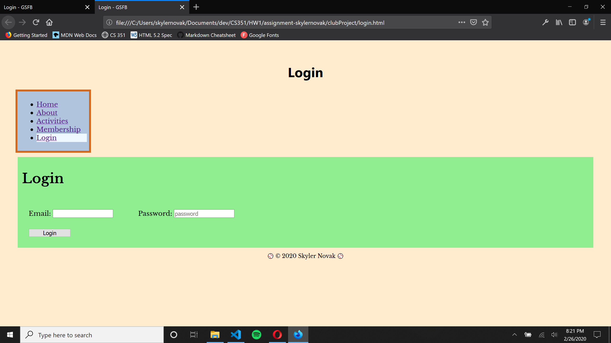
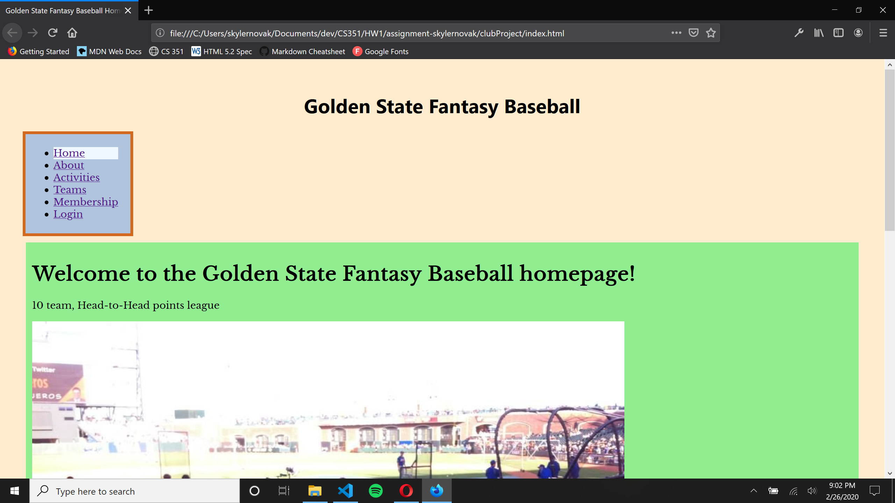

# Homework #4 Solution
**Skyler Novak**

**NetID: ix9753**

# Question 1

## (a)

 Login page created with email and password fields, and a button to submit info

 ## (b)

```javascript
let loginbtn = document.getElementById("login-button");

function btnHandler() {
    let user_email = document.getElementById("username").value;
    let user_pword = document.getElementById("password-field").value;
    console.log("Email: " + user_email);
    console.log("Password: " + user_pword);
}

loginbtn.addEventListener('click', btnHandler);
```



# Question 2

## (a)

```javascript
events = [
    {
        "Name": "Online Snake Draft",
        "Date": "Sunday, March 22nd"
    },
    {
        "Name": "All-Star Game",
        "Date": "July 14th"
    },
    {
        "Name": "Trade Deadline",
        "Date": "August 25th"
    }
]
```

## (b)



```javascript
function eventsTable() {
    let tbody = document.querySelector("#Events table tbody");

    events.forEach(function(events) {
        let tr = document.createElement("tr");
        tr.innerHTML = `<td>${events.Name}</td><td>${events.Date}</td>`;
        tbody.appendChild(tr);
    })
}

window.onload = eventsTable;
```

# Question 3

## (a)

```html
<h1>New Membership Application</h1>
<p>Please enter the following info. As soon as a team 
    becomes available, we will contact you. 
</p>
<p>Full Name: <input type="text" id="ownerName" name="ownerName" placeholder="Babe Ruth"></p>
<p>Email: <input type="email" id="ownerEmail" name="ownerEmail" placeholder="babe@ruth.com"></p>
<p>Phone: <input type="tel" id="ownerTel" name="ownerTel" placeholder="510-555-5555" pattern="[0-9]{3}-[0-9]{3}-[0-9]{4}"></p>
<p>Experience: <select class="expDropdown">
    <option value="">No. of Years</option>
    <option value="0">Never</option>
    <option value="1">1 year</option>
    <option value="1">2-3 years</option>
    <option value="1">4+ years</option>
    </select></p>
<p>Comments: <textarea cols="30" rows="8"
    placeholder="Questions/Comments/etc.">
    </textarea></p>
<input type="button" id="submit-button" value="Submit">  
```

## (b)

no answer requested

## (c)

no answer requested

## (d)

```javascript
function memberScripts() {
    let submitBtn = document.getElementById("submit-button");
    let closeBtn = document.getElementById("close-button");

    function closeModal() {
        let myModal = document.getElementById("ThanksDialog");
        myModal.classList.remove("ShowDialog");
    }

    function summarizeDat(elementName, elementValue) {
        let thxsDiag = document.querySelector("#ThanksDialog");
        let p = document.createElement("p");
        p.innerText = elementName + elementValue;
        thxsDiag.append(p);
    }

    function btnHandler() {
        let owner_name = document.getElementById("ownerName").value;
        summarizeDat("Name: ", owner_name);
        let owner_email = document.getElementById("ownerEmail").value;
        summarizeDat("Email: ", owner_email);
        let owner_tel = document.getElementById("ownerTel").value;
        summarizeDat("Phone: ", owner_tel);
        let exp_select = document.getElementById("ownerExp");
        let owner_exp = exp_select.options[exp_select.selectedIndex].text;
        summarizeDat("Experience: ", owner_exp);
        let owner_comments = document.getElementById("ownerCom").value;
        summarizeDat("Comments: ", owner_comments);
    }

    submitBtn.addEventListener('click', btnHandler);
    closeBtn.addEventListener('click', closeModal);
}

window.onload = memberScripts;
```

# Question 4

## (a)



```css
#newMemberForm {
    display: grid;
    grid-template-columns: 10em 20em;
    padding: 1em;
    grid-row-gap:1em;
    grid-column-gap: 1em;
    margin: 0.5em;
    border: solid #55cedc;
    border-radius: 15px;
    max-width: 40em;
  }

  #newMemberForm label {
    justify-self: end;
  }
```

## (b)

```css
.ShowDialog {
    background-color: #f4f4f4;
    margin: 15% auto;
    padding: 20px;
    border: 1px solid #888;
    width: 80%;
    box-shadow: 0 5px 8px 0 rgba(0, 0, 0, 0.2), 0 7px 20px 0 rgba(0, 0, 0, 0.17);
}

#ThanksDialog {
    display: none;
    position: fixed;
    z-index: 1;
    left: 0;
    top: 0;
    height: 100%;
    width: 100%;
    overflow: auto;
    background-color: rgba(0, 0, 0, 0.5);
}
```

## (c)



```css
  #login-grid {
    display: grid;
    grid-template-columns: 15em 15em;
    padding: 1em;
    grid-row-gap: 10px;
    grid-column-gap:20px;
  }

  #login-button {
      width: 100px;
  }
```

## (d)



```css
header footer {
    display: flex;
    flex-direction: column;
    justify-content: center;
}

nav {
    display: flex;
    align-self: flex-start;
}
```