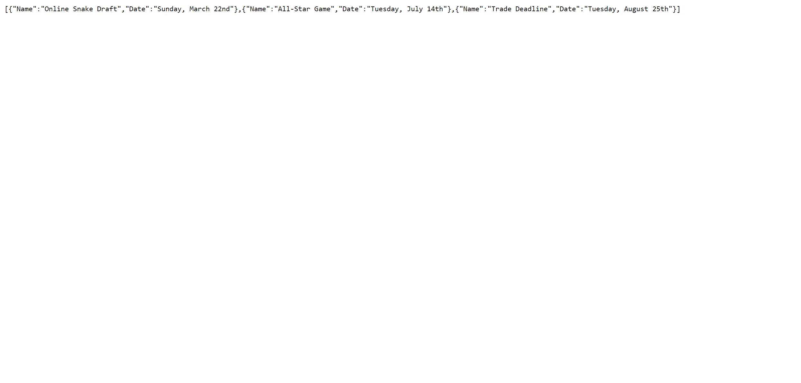

# Homework 9 Solution
**Skyler Novak**

**NetID: ix9753**

# Question 1

## (a)

```Javascript
let salt = bcrypt.genSaltSync(10); // create a new salt
users.forEach(function(user) {
    let passHash = bcrypt.hashSync(user.password, salt);    // hash password with the salt
    user.password = passHash;   // update user password with hash
    hashedUsers.push(user); // add users with hashed passwords to DB
});
```

example of hashed user

```JSON
{
    "firstName": "Marx",
    "lastName": "Wolf",
    "email": "dewit1966@gmail.com",
    "password": "$2a$10$TcB0KAw2faioVzWjK.HMn.H051Mudk027L98V56YfXwKlqdfD6zbu",
    "role": "member"
}
```

## (b)


# Question 2

## (a)



```Javascript
app.get('/activities', function(req, res){
    res.json(events);
});
```

## (b)


```JavaSCRIPT
const rp = require("request-promise-native");
const events = require('./eventData.json');

var options = {
    uri: 'http://127.9.19.28:4188/activities',
    headers: {
        'User-Agent': 'Request-Promise'
    },
    json: true // Automatically parses the JSON string in the response
};

rp(options)
    .then(function (event) {
        console.log(event);
    })
    .catch(function (err) {
        // call failed...
    });
```