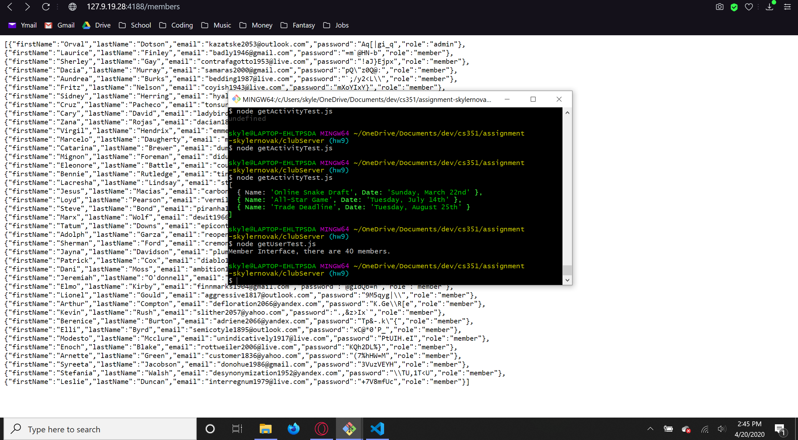
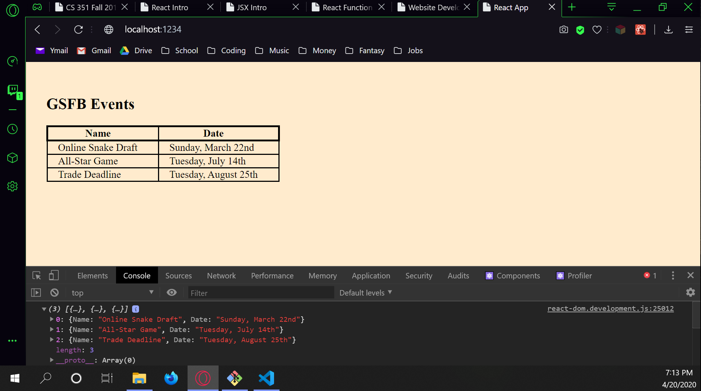

# Homework 7 Solution
**Skyler Novak**

**NetID: ix9753**

# Question 1

## (a)

Three reasons I would use a static web site are:

+ Security - Static web pages reduce risks associated with dynamic server generated web pages

+ Reliability - Static web pages suffer from less issues conneting to the pages, and assests failing to load are minimized. 

+ Speed - Static web pages are much faster to load than dynamic ones. 

## (b)

By default, Metalsmith takes the files from the source folder, processes them with any plugins, and places these new files in the destination directory. Metalsmith represents files in the source directory as a JavaScript object. 

## (c)

You may want to attach information such as page titles, or JS source files, as metadata in the sorce files. You can add metadata in the following way:

At the top of the source files, include

```YAML
---
    title: myTitle
    jsSRC: myFile.js
---
```

all metadata must be inbetween a starting and ending "---". This is YAML formatting. 

## (d)

A metalsmith plugin is given three pieces of information. 1) the JavaScript object files to be manipulated 2) Metalsmith 3) done objects that signal an operation has been completed during asynchronous operations. By default, the JavaScript object of the source files are given to a Metalsmith plugin. 

# Question 2

## (a)

The HTTP method Get is used when i visit the BlackBoard log in page request. The response code is `200 OK` which means the response request has succeeded. HTTP version 1.1 is used. 

## (b)

GET / HTTP/1.1

Host: bb.csueastbay.edu

Connection: keep-alive

Cache-Control: max-age=0

Upgrade-Insecure-Requests: 1

User-Agent: Mozilla/5.0 (Windows NT 10.0; Win64; x64) AppleWebKit/537.36 (KHTML, like Gecko) Chrome/80.0.3987.116 Safari/537.36 OPR/67.0.3575.87

Sec-Fetch-Dest: document

Accept: text/html,application/xhtml+xml,application/xml;q=0.9,image/webp,image/apng,*/*;q=0.8,application/signed-exchange;v=b3;q=0.9

Sec-Fetch-Site: none

Sec-Fetch-Mode: navigate

Sec-Fetch-User: ?1

Accept-Encoding: gzip, deflate, br

Accept-Language: en-US,en;q=0.9

Cookie: AWSELB=D3570BC914533D9ACC5FBEA2A258730F699E691A0AC95F4514958C9FF4BF56EAF7767641A5C5E92CB998EE0E9B2C7D078D47B8E475CDC13F023DACA557A5F053AA4579C9C1; AWSELBCORS=D3570BC914533D9ACC5FBEA2A258730F699E691A0AC95F4514958C9FF4BF56EAF7767641A5C5E92CB998EE0E9B2C7D078D47B8E475CDC13F023DACA557A5F053AA4579C9C1; __utma=208548673.154373181.1584913124.1584913124.1584913124.1; __utmc=208548673; __utmz=208548673.1584913124.1.1.utmcsr=(direct)|utmccn=(direct)|utmcmd=(none); __utmt=1; __utmb=208548673.1.10.1584913124; JSESSIONID=F0205ADBD3B027DD82D727A4A098DC68; BbRouter=expires:1584914927,id:8F6B7D5198CE0A094DDD8B2B5C757184,signature:2cf7147da1a1b81b2481d3c8f767c18c30e533055ebd7d56b41ce692d61f3651,site:aefdf5db-8c6a-4e8e-8bf7-fb9f1f4dcdf0,v:2,xsrf:15cc218e-402c-4f30-9a70-09c2005e586e

## (c)

Cache-Control: private

Cache-Control: max-age=0

Cache-Control: no-store

Cache-Control: must-revalidate

Connection: keep-alive

Content-Encoding: gzip

Content-Language: en-US

Content-Length: 18472

Content-Security-Policy: frame-ancestors 'self'

Content-Type: text/html;charset=UTF-8

Date: Sun, 22 Mar 2020 21:39:23 GMT

Expires: Fri, 22 Mar 2019 21:39:23 GMT

Last-Modified: Wed, 22 Mar 2000 22:39:23 GMT

P3P: CP="CAO PSA OUR"

Pragma: private

Server: openresty/1.9.3.1

Set-Cookie: BbRouter=expires:1584914963,id:8F6B7D5198CE0A094DDD8B2B5C757184,signature:29524ffe3ec804600ecc60d0ed6781075df4c0ca22dd51c10553b35de0d1d7e9,site:aefdf5db-8c6a-4e8e-8bf7-fb9f1f4dcdf0,v:2,xsrf:15cc218e-402c-4f30-9a70-09c2005e586e; Path=/; Secure; HttpOnly

Vary: Accept-Encoding

X-Blackboard-appserver: ip-10-145-60-190.ec2.internal

X-Blackboard-product: Blackboard Learn &#8482; 3800.4.0-rel.40+d78544e

X-Frame-Options: SAMEORIGIN

## (d)

Blackboard is based on the OpenResty Server. The associated set cookies are:

BbRouter=expires:1584914963,id:8F6B7D5198CE0A094DDD8B2B5C757184,signature:29524ffe3ec804600ecc60d0ed6781075df4c0ca22dd51c10553b35de0d1d7e9,site:aefdf5db-8c6a-4e8e-8bf7-fb9f1f4dcdf0,v:2,xsrf:15cc218e-402c-4f30-9a70-09c2005e586e; Path=/; Secure; HttpOnly

## (e)

```JavaScript
var myDate = new Date()
myDate.toISOString().toLowerCase().split("t")[1]
```

The second line takes the `myDate` object, and then performs each object method on it, in order from left to right. First the date object is set to ISO 8601 format of YYYY-MM-DDThh:mm:ss.sssZ where T is a deliminator between the date and the time components. Next the string is converted to lower case, and then finally the plit method divides the object string into substrings based on the deliminator "t". So we have an array of strings { "YYYY-MM-DD", "hh:mm:ss.sssZ" }. the [1] at the end of the statement will return the time component of the myDate object. 

## (f)

https://developer.mozilla.org/en-US/docs/Web/JavaScript/Guide/Grammar_and_Types#Comments

Protocol: https://

Domain: developer.mozilla.org

Path: /en-US/docs/Web/JavaScript/Guide/Grammar_and_Types

Fragment: #Comments

https://www.google.com/search?q=gaia+mission&rlz=1CYPO_enUS751

Protocol: https://

Domain: www.google.com

Path: /search

Query: ?q=gaia+mission&rlz=1CYPO_enUS751

http://127.0.0.2:8282/static/index.html

Protocol: http://

Domain: 127.0.0.2

Port: 8282

Path: /static/index.html

# Question 3

## (a)

The output is:

```
Is this the start?
When does this print?
Is this the end?
this is a msg from CS651
This is a msg from CS351
```

This is because there is not actually a zero delay with the callback functions. The two callback functions are added to the event queue, but they will not execute until all other events have processed. The fact that they both have 0 milliseconds to execute in the setTimeout function is a minimum time, not a garenteed time to execute. 

## (b)

The following code establishes an array of 3 promises. Then a promise race is implemented. Each of the three promises is set to resolve sometime between 0 and 1 seconds. The promise that resolves first will be declared the winner and will print to the screen. As soon as one promise resolves or rejects, the race will conclude. To determine the winner, append `.then(winner)` to the last line as so:

```JavaScript
racingPs = Promise.race(myPs).then(winner);
```

## (c)


## (d)


# Question 4

## (a)


## (b)



## (c)


