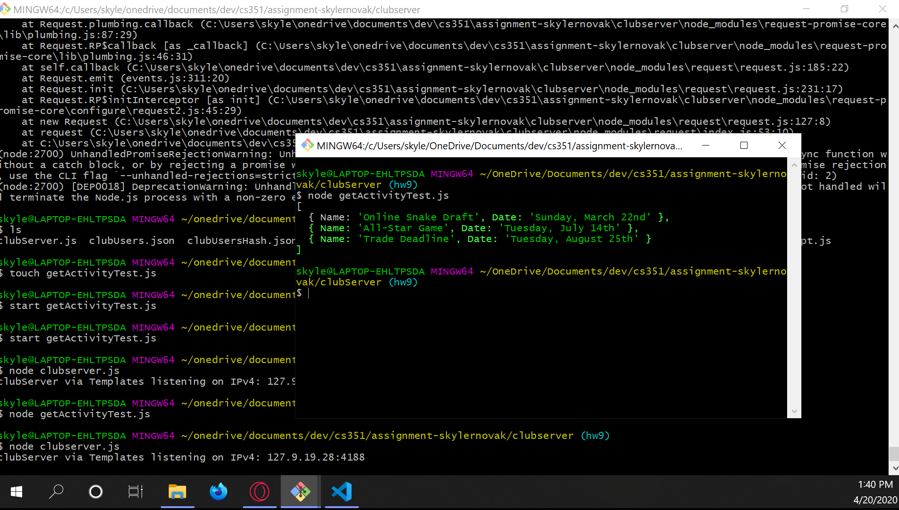

# Homework 5 Solution
**Skyler Novak**

**NetID: ix9753**

# Question 1

## (a)

Node.js version 12.16.1

## (b)

I ran npm init and followed the question prompts. Most of the questions I accepted the default.

## (c)

json stands for JavaScript Object Notation

## (d)

number 2 is the correct json syntax

`{"name": "Dr. B", "course": "Web stuff"}`

## (e)

JSON files can be used to interchange data between application, such as a JavaScript application and a C++ application. 

## (f)

my directory structure


## (g)

added the appropriate lines to .gitignore

## (h)

installed Nunjucks version 3.2.0

# Question 2

## (a)

```javascript
<!DOCTYPE html>
<html lang="en">
    <head>
        <meta charset="utf-8">
        <title>Your Club Name Here - need templates</title>
        <link href="../styles/club.css" rel="stylesheet">
    </head>
    <body>
    <nav>
      
    </nav>
    <main>
        {{mainContent | safe}}
    </main>
    <footer>&#x26be &copy 2020 Skyler Novak &#x26be</footer>
    </body>
</html>
```

## (b)

boilerplate html removed from index.html

## (c)

runIt.js file created

## (d)


# Question 3

## (a)

```javascript
[
    {"fname": "index.html", "title": "Golden State Fantasy Baseball Homepage", "header": "Golden State Fantasy Baseball"},
    {"fname": "About.html", "title": "About - GSFB", "header": "About"},
    {"fname": "Activities.html", "title": "Activities - GSFB", "header": "Activities"},
    {"fname": "Login.html", "title": "Login - GSFB", "header": "Login"},
    {"fname": "Membership.html", "title": "Membership - GSFB", "header": "Membership"},
    {"fname": "Teams.html", "title": "Teams - GSFB", "header": "Teams"}
]
```

## (b)

```html
<ul>
    <li><a href="index.html">Home</a></li>
    <li><a href="About.html">About</a></li>
    <li><a href="Activities.html">Activities</a></li>
    <li><a href="Teams.html">Teams</a></li>
    <li><a href="Membership.html">Membership</a></li>
    <li><a href="Login.html">Login</a></li>
</ul>
```

## (c)

template now includes meta data

## (d)

HTML boilerplate removed and javascript still functions

## (e)



# Question 4

## (a)


## (b)


## (c)

enabled menu to open

## (d)

http://csweb01.csueastbay.edu/~ix9753/clubProject/