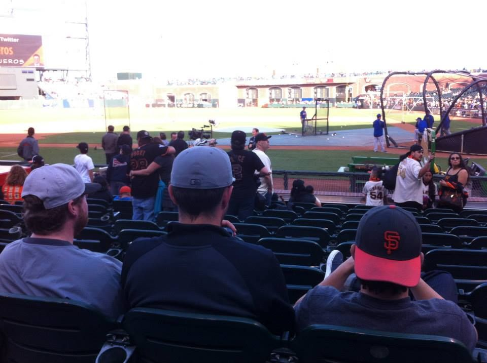

# Welcome to the Golden State Fantasy Baseball homepage!

10 team, Head-to-Head points league

## League History &#x1f3c6

+ 2019 - Appian Assault, Forest Novak

+ 2018 - SF Crusaders, Tom Oneto

+ 2017 - Bixby Kings, Skyler Novak

+ 2016 - Chico PEDs, Alex Ging

+ 2015 - Bay Area BALLerz, Cameron Ball

+ 2014 - Fresno Foul-Ballers, Forest Novak

## News & Notes:

1. <a href="https://www.espn.com/mlb/story/_/id/28852075/yankees-slugger-aaron-judge-stress-fracture-rib">Yanks' Aaron Judge out indefinitely with broken rib, hopes to avoid surgery</a>

2. <a href="https://www.nytimes.com/2020/02/25/sports/baseball/luis-severino-tommy-john.html">Yankees’ Luis Severino to Miss 2020 Season After Elbow Surgery</a>

3. <a href="https://www.cbssports.com/fantasy/baseball/news/2020-fantasy-baseball-draft-prep-giancarlo-stantons-latest-injury-could-turn-slugger-into-a-draft-bargain/">Giancarlo Stanton's latest injury could turn slugger into a draft bargain</a>

4. <a href="https://www.espn.com/fantasy/baseball/story/_/id/28785811/cockcroft-fantasy-baseball-playbook">Cockcroft's fantasy baseball playbook</a>

5. <a href="https://www.fantasypros.com/2020/02/10-breakout-pitchers-for-2020-fantasy-baseball/">10 Breakout Pitchers for 2020</a>

Since 2014
